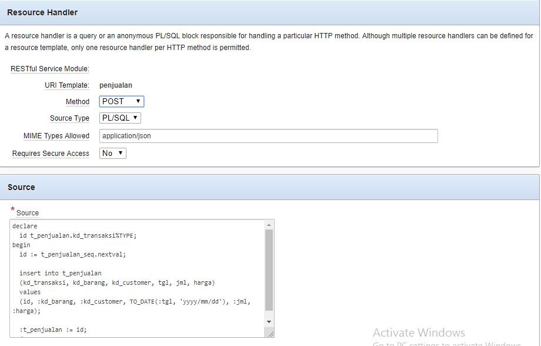

  
# UAS Pemrosesan Data Tersebar

Aplikasi Pembelian dan Penjualan dengan menggunakan database Oracle, System Administrator menggunakan CodeIgniter dan Interface di Mobile Apps (Android). Komunikasi data antar Aplikasi menggunakan *RESTful Service* di oracle.

## Requirements

- [Virtual Box](https://www.virtualbox.org/wiki/Downloads) (Virtual Server)
- [Oracle Developer Day 11g](https://www.oracle.com/technetwork/database/enterprise-edition/databaseappdev-vm-161299.html) (Database)
- [Android Studio](https://developer.android.com/studio) (Android IDE)
- [Codeigniter](https://www.codeigniter.com/) (Framework PHP)

## Tutorial

### Database

Aplikasi ini memiliki 5 table, yaitu :

1. [Customer](#table-customer)
2. [Barang](#table-barang)
3. [Penjualan](#table-penjualan)
4. [Pembelian](#table-pembelian)
5. [Supplier](#table-supplier)

#### Table Customer


#### Table Barang


#### Table Penjualan


#### Table Pembelian


#### Table Supplier


### *RESTful Services*


PUT dan DELETE menggunakan {id} untuk mengidentifikasi data yang akan dieksekusi.  
Metode HTTP yang digunakan dalam aplikasi ini adalah:

| Method | Description |
| ------ | ------ |
| **GET** | menyediakan hanya akses baca pada _resource_ |
| **POST** | digunakan untuk menciptakan _resource_ baru |
| **PUT** | digunakan untuk memperbarui _resource_ yang ada atau membuat _resource_ baru |
| **DELETE** | digunakan untuk menghapus _resource_ |

*Resource Handler* & *Query* dapat dilihat pada gambar dibawah ini.

#### *RESTful Service* pada Barang

- **GET Barang**  


- **POST Barang**  


- **PUT Barang**  


- **DELETE Barang**  


#### *RESTful Service* pada Customer

- **GET Customer**  


- **POST Customer**  


- **PUT Customer**  


- **DELETE Customer**  


#### *RESTful Service* pada Penjualan

- **GET Penjualan**  


- **POST Penjualan**  


#### *RESTful Service* pada Pembelian

- **GET Pembelian**  


- **POST Pembelian**  



#### *RESTful Service* pada Supplier

- **GET Supplier**  


- **POST Supplier**  


- **PUT Supplier**  


- **DELETE Supplier**  


### CodeIgniter

[Script](./oracle-uas/application/libraries/Api.php) dibawah ini merupakan script php yang digunakan untuk mengakses *RESTful Services* dari Oracle menggunakan library [Goutte](https://github.com/FriendsOfPHP/Goutte).

```php
use GuzzleHttp\Client;

defined('BASEPATH') or exit('No direct script access allowed');

class Api
{
    private $client;

    public function __construct()
    {
        // base url yang digunakan untuk mengakses RESTful API
        $this->client = new Client(['base_uri' => 'http://192.168.43.75:8888/apex/obe/']);
    }

    public function request($method, $uri, $data = [])
    {
        // data di convert menjadi data JSON
        $options['json'] = $data;

        // jika metode HTTP nya adalah DELETE maka response yang diberikan adalah status code nya
        if ($method == 'delete') {
            $request = $this->client->request($method, $uri);
            return $request->getStatusCode();
        }

        $request = $this->client->request($method, $uri, $options);

        // response yang diberikan berupa content nya
        return $request->getBody()->getContents();
    }
}
```

#### Tampilan Web

- Barang


- Customer


- Penjualan


- Pembelian


- Supplier


#### Tampilan Mobile Apps


### License

Copyright © 2019, [Bekti Widianto](https://github.com/bektiwidianto).
